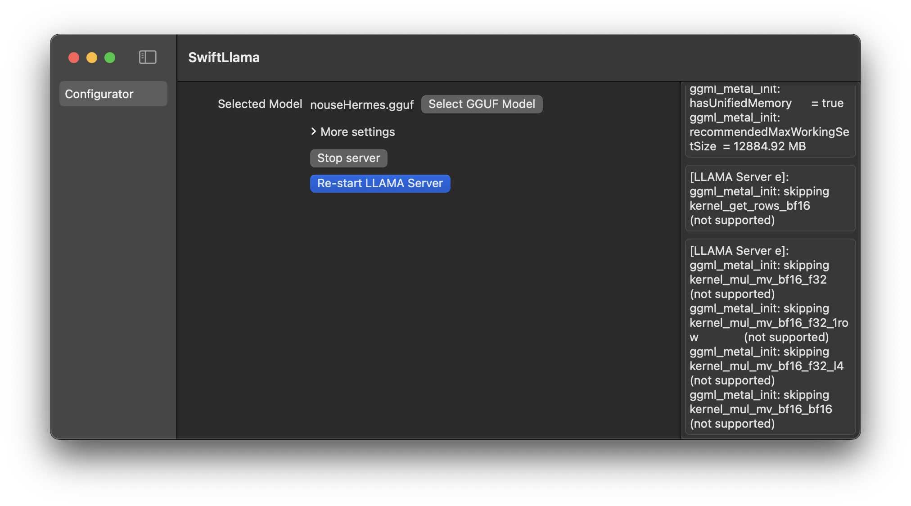
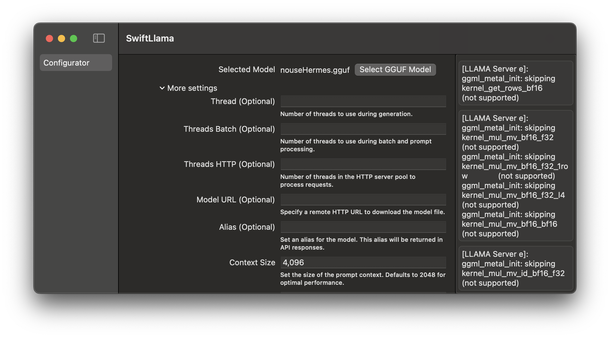

# SwiftLlamaApp

This App is built to showcase the usage of [SwiftLlama](https://github.com/DominatorVbN/SwiftLlama) SPM package that let us run LLAMA.cpp server right from our macOS Apps.

## Running the app

#### Clone the repository

``` b
git clone https://github.com/DominatorVbN/SwiftLlamaApp.git
```

Fetch swift packages and hit run.





## Utilising the configurator

Other than being the example project of [SwiftLlama](https://github.com/DominatorVbN/SwiftLlama) this project have one more purpose. This app lets you configure the exhuastive list of parameters available for LLAMA.cpp server executable. You can use this project to try out diffrent configuration while running the server before setting those configs in your apps.